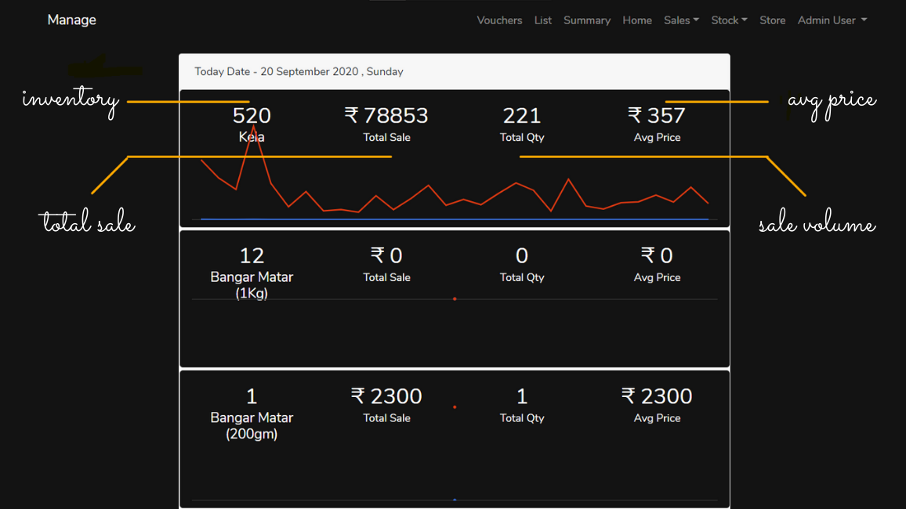
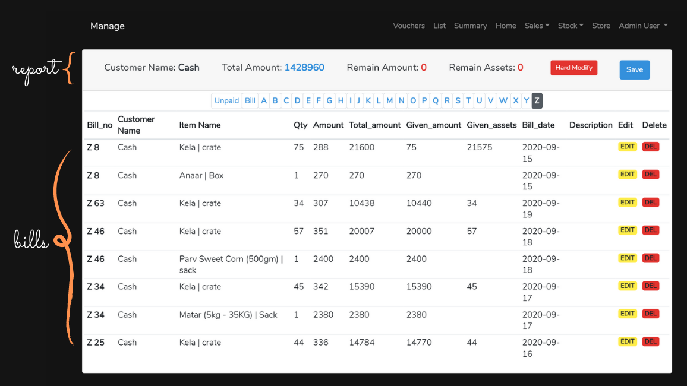
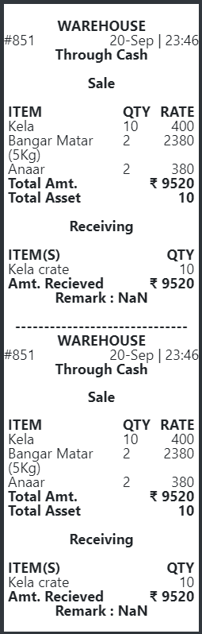
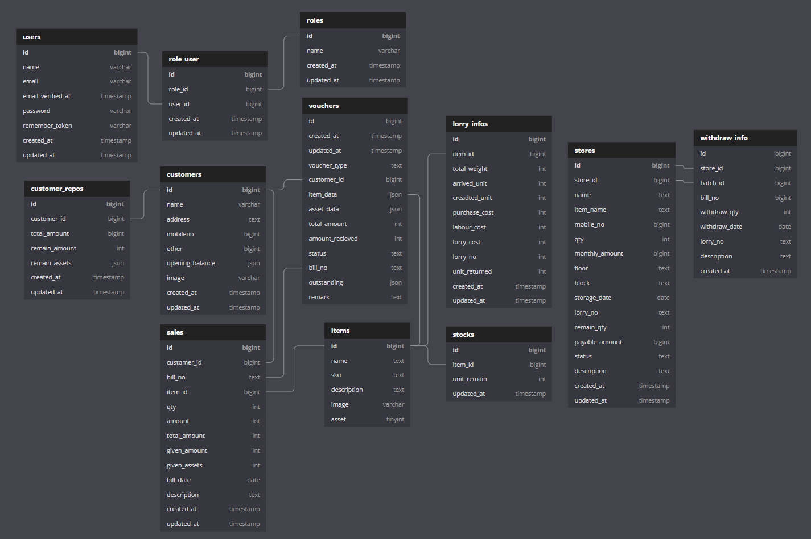

<h1 align="center"> WAREHOUSE AUTOMATION 🤖</h1>
<h3 align="center"> Custom accounting software application capable of handling different warehouse departments with ease.❤️</h3>

## The general way 🚴🏻‍♂️ -
Creating the invoices and bills and summarizing it at the end of the day and generating a report for each customer outstanding by maintaining bill books and notebooks.

## Problem with it 🚫 -
1. Creating a summary and report takes a substantial amount of time each day. ⌚
2. Informing customers about their up to-dated outstanding real-time. 🤝🏻
3. Can potentially cause loss if the customer is ready to settle their outstanding but inability to tell them their up to-dated outstanding instantaneously. 📉
4. Human error while creating a summary or report and ability to rectify it. ❌
5. Need for cross-checking of invoices and bills with the customer at the time of issues.⏳
6. Storing and maintaining all records for future needs. 📚
7. Inability to gather insights from past data. 🕳️

## Analysing the cause 🔍 -
1. Well most of the problems appear to be caused because of two reasons inability to create reports regularly and possible human error during the creation of it.
2. Unable to make queries through records due to an abundance of it.  

## Pairing the Technology with the Solution 🔌 -
An application that is capable of generating bills, making a summary through it, and generating reports based on bills on the go.

Hence, project **WAREHOUSE AUTOMATION**. 🥂

## Features -
1. Display inventory of the items in the warehouse.
2. Creation and updation of inventory.
3. Creation and updation of bills and generate summary and report based on it.
4. Calculates overall sales volume, total sales, and the average sale price of each item.
5. Display and print customer reports and all the bills associated with him/her.    
Special features
6. Ability to create and print point of sale vouchers.
7. Past 30-day sales comparison.
8. Multirole authentication for Admin, employee, and customers.
9. All the features are available on the website as well as the app.  
10. Automatic emailing of reports to the customer (Ongoing).

## Screenshots 🖼️-

<!--  -->
<!-- 
 -->

<!-- 
 -->

  

## Database Schema 🧾-
The skeleton structure representing the logical view of the entire database of the project.

## License 📄
This project is Licensed under the [MIT License](LICENSE).
